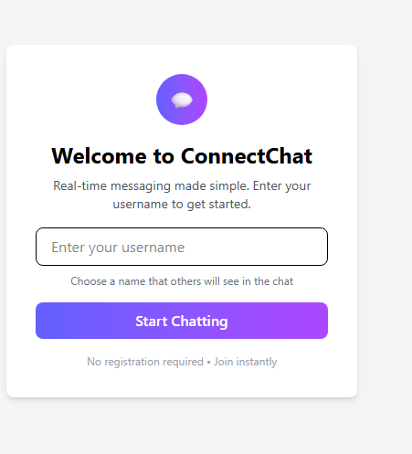

# 💬 Real-Time Chat Application

A full-stack real-time chat application built with **Node.js**, **Socket.io**, **React**, and **Tailwind CSS**. Users can join a global chat room, see who is online, send messages in real-time, and see when others are typing.

---

## 📁 Project Structure

```
socketio-chat/
├── client/                 # React front-end
│   ├── public/             # Static files
│   ├── src/                # React source code
│   │   ├── components/     # UI components
│   │   ├── context/        # React context providers
│   │   ├── hooks/          # Custom React hooks
│   │   ├── pages/          # Page components
│   │   ├── socket/         # Socket.io client setup
│   │   └── App.jsx         # Main application component
│   └── package.json        # Client dependencies
├── server/                 # Node.js back-end
│   ├── config/             # Configuration files
│   ├── controllers/        # Socket event handlers
│   ├── models/             # Data models
│   ├── socket/             # Socket.io server setup
│   ├── utils/              # Utility functions
│   ├── server.js           # Main server file
│   └── package.json        # Server dependencies
└── README.md               # Project documentation
```


---

## ⚙️ Features

- Realtime messaging using Socket.io
- Join a global chat room
- Typing indicators
- User join/leave notifications
- Online users list
- Clean UI with Tailwind CSS

---

## 🚀 Getting Started

### 1. Clone the repository
```bash
git clone https://github.com/your-username/socketio-chat.git
cd socketio-chat

```
## 📸 Screenshots

### 💬 Chat Interface


